# Nghiên Cứu Khoa Học

# Understanding Machine Learning
## 1. Overview:
* What machine learning is?
* Machine learning process
* Basic concepts & terminology

## 2. What is machine learning?
What machine learning does?

* Finds patterns in data
* Uses those patterns to predict the future
* Examples:
	* Detecting credit card fraud
	* Determining whether a customer is likely to switch to a competitor
	* Deciding when to do preventive maintenance on a factory robot

What does it mean to learn?

Learning requires:
* Identifying patterns
* Recognizing those patterns when you see them again

This is what machine learning does

## 3. Machine learning in a nutshell
- Data: contains pattern  
-> Feed data into a machine learning algorithm  
- Machine learning algorithm: finds patterns  
-> The algorithm generates something called a model  
- Model: recognizes patterns  
-> Application supplies data to the model  
- Application: Supplies new data to see if it matches known pattern

## 4. Why is machine learning is so hot right now?
Doing machine learning requires:
* Lots of data: (Big data)
* Lots of computer power: (Cloud computing)
* Effective machine learning algorithms  
=> All of those things are now more available than ever

## 5. Who's interested in Machine learning?
1. Business leaders: want solutions to bussiness problems
2. Software developers: want to create better applications
3. Data scientists: want to powerful, easy-to-use tools

## 6. The ethics of Machine learning?
- What if the data is biased?
- How can you explain a model's decision?

## 7. The main points
- Machine learning lets us find patterns in existing data, then create and use a model that recognizes those patterns in new data
- Machine learning has gone mainstream
	- Although it raises ethical concerns
- Machine learning can probably help your organization

## 8. The machine leaning process

Iterative: In both big and small ways

Challenging: It's rarely easy

Often rewarding: But not always

## 9. The first problem: asking the right question

Choosing what question to ask is the most important of the process

Ask yourself: do you have the right data to answer this question?

Ask yourself: do you know how you'll measure success?

## 10. A closer look at Machine learning
- Training data
- Supervised and unsupervised learning
- Classifying machine learning problems and algorithms
- Training a model
- Testing a model
- Using a model 
### Some terminology
- Training data: the prepared data used to create a model
- Creating a model is called training a model
- Supervised learning: the value you want to predict is in the training data. The data is labeled
- Unsupervised learning: the value you want to predict is not in the training data. The data is unlabeled

### 10.1 Data preprocessing with supervised learning
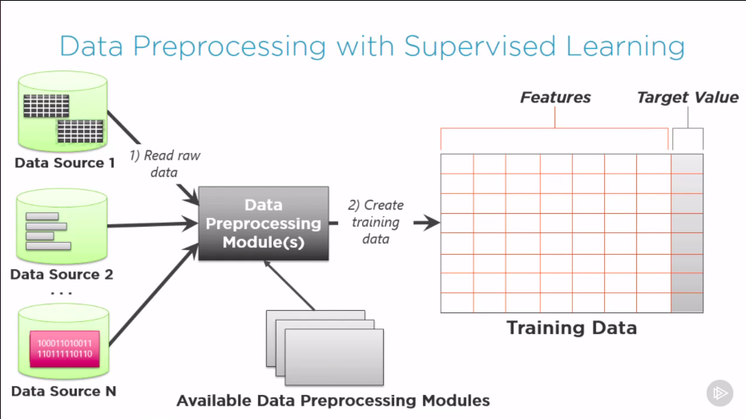

### 10.2 Categorizing machine learning problems: 
#### 1. Regression:
The problem here is that we have data, and we'd like to find a line or curve that best fits that data. Regression problems are typically supervised learning scenarios.
An example question would be something like: how many units of this product will we sell next month?
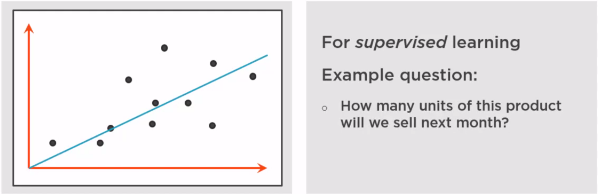

#### 2. Classification
Here, we have data that we want to group into classes, at least two, can be more than two classes. When new data comes in, we want to determine which class that data belongs to. This is commonly used with supervised learning and an example question would be something like: Is this credit card transaction fraudulent? When a new transaction comes in, we want to predict which class it's in, fraudulent or not fraudulent. And often, what you'll get back is not yes or no, but a probability of which class this new transaction might be in.
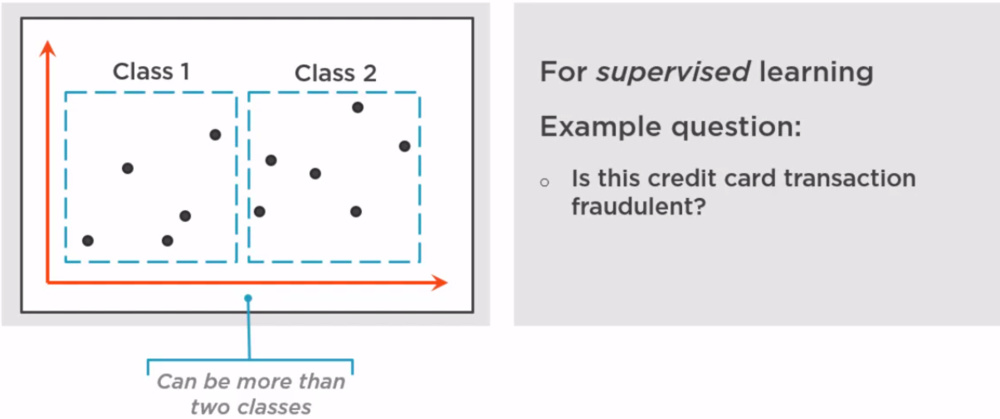

#### 3. Clustering
Here, we have data. We want to find clusters in that data. This is a good example of when we're going to use unsupervised learning because we don't have labeled data. We don't know necessarily what we're looking for. An example question here is something like what are our customer segments? We might not know these things up front, but we can use machine learning, unsupervised machine learning to help use figure that out.
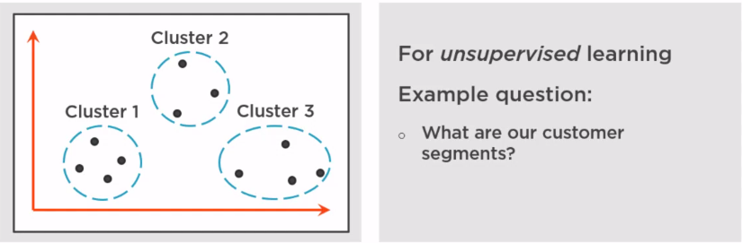

### 10.3 Styles of machine learning algorithms
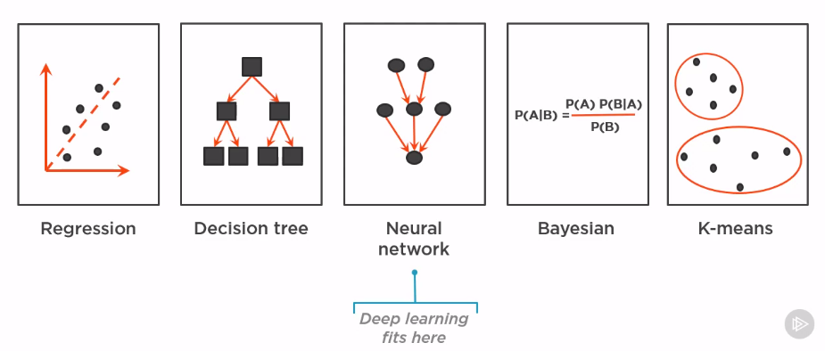

### 10.4 Training a model with supervised learning
Traing a model with supervised learning
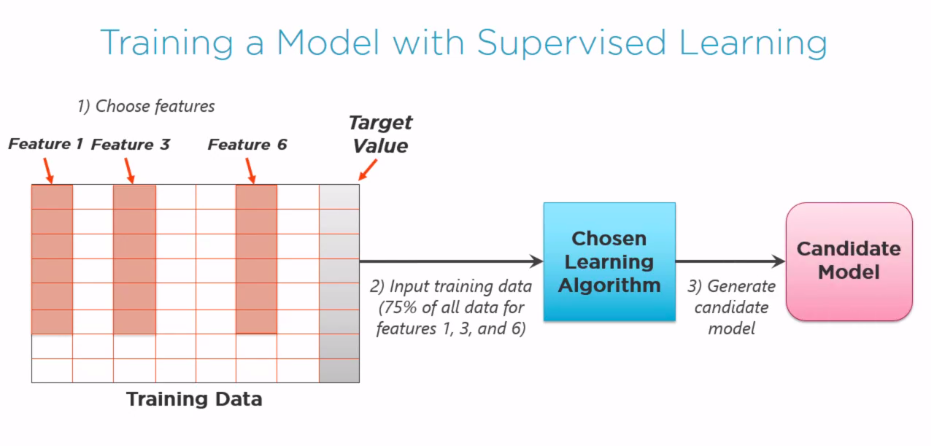

Testing a model
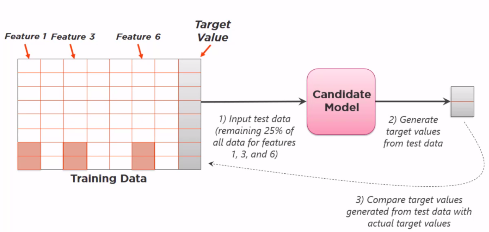

Improving a model
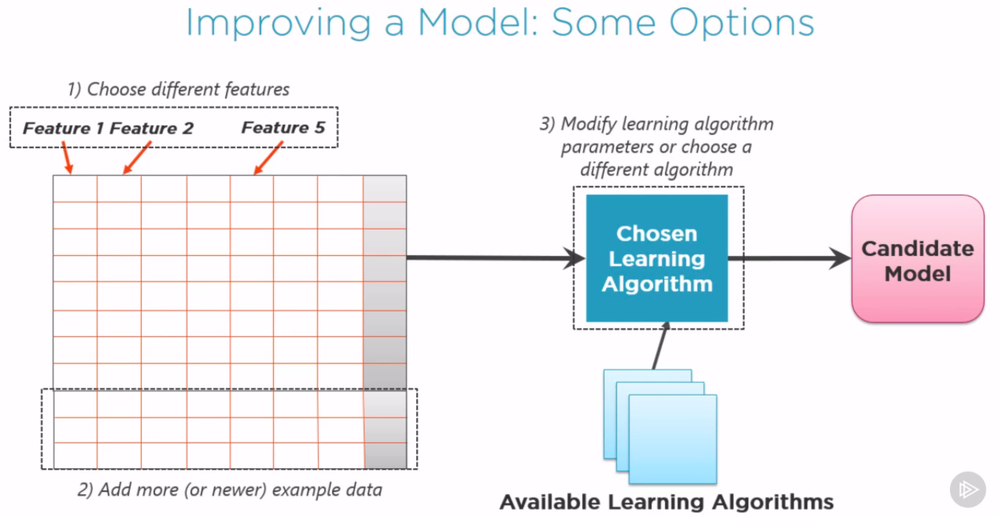

### 10.5 Using a model
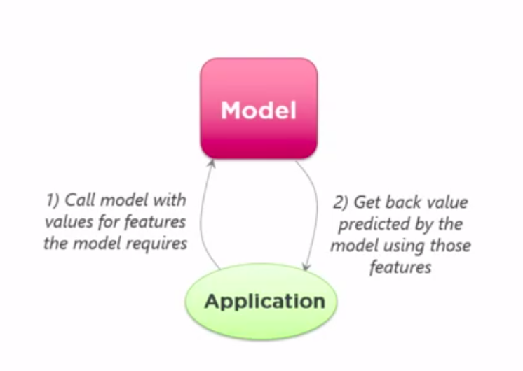

### 10.6 Implementing machine learning: Example technologies
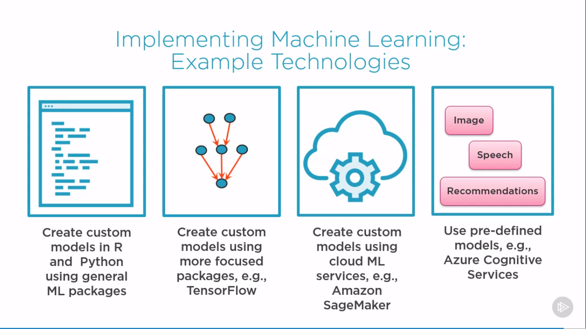

# Understanding Machine Learning with Python
## 1. Getting started in Machine learning
### 1.1: What is machine learning?
Machine learning in action:
* Is this email spam?
* How can cars drive themselves?
* What will people buy?
	
> Machine learning
> Build a model from example inputs to make data-driven predictions vs. following strictly static program instructions

### 1.2: Types of Machine learning?
1. Supervised:
- Value prediction
- Needs training data containing value being predicted
- Training model predicts value in new data

2. Unsupervised:
- Identify clusters of like data
- Data does not contain cluster membership
- Model provides access to data by cluster

## 2. Understanding the machine learning workflow
Machine learning workflow
> An orchestrated and repeatable pattern which systematically transforms and processes information to create prediction solutions.

Workflow:
1. Asking the right question
2. Preparing data
3. Selecting the algorithm
4. Training the model
5. Testing the model

### Machine learning workflow guidelines
- Early steps are most important: Each step depends on previous steps
- Expect to go backwards: later knowledges effects previous steps
- Data is never as you need it: data will have to be altered
- More data is better: more data => Best results
- Don't pursue a bad solution: reevalute, fix or quit

### 2.1: Asking the right question
- Deine scope (including data sources)
- Define target performance
- Define context for usage
- Define how solution will be created

> Use the Machine learning workflow to process and transform Pima Indian data to create a prediction model. This model must predict which people are likely to develop diabetes with 70% or greater accuracy.

### 2.2: Preparing your data
- Find the data we need
- Inspect and clean the data
- Explore the data
- Mold the data to Tidy data

#### Tidy Data
> Tidy datasets are easy to manipulate, model and visualize, and have a specific structure:
- each variable is a column,
- each observation is a row,
- each type of observational unit is a table

50-80% of a Machine Learning project is spent getting, cleaning, and organizing data

#### Getting data
* Google
* Government databases
* Professional or company data sources
* Your company
* Your department
* All of the above

##### Data Rule #1
Closer the data is to what you are predicting, the better

##### Data Rule #2
Data will never be in the format you need (pandas DataFrames)

##### Data Rule #3
Accurately predicting rare events is difficult

#### Data Rule #4
Track how you minipulate data

### 2.3: Selecting Your Algorithm
Algorithm Selection:
* Compare factors
* Difference of opinions about which factors are important
* You will develop your own factors

Algorithm Decision Factors:
* Learning type
* Result
* Complexity
* Basic vs enhanced

### 2.4: Training The Model
> Machine Learning Training
> Letting specific data teach a Machine Learning algorithm to create a specific prediction model

# Foundations of PyTorch

## 1. Course outline
### 1.1 Getting started with PyTorch
* Introducing neural networks and PyTorch
* Tensor operations and CUDA support

### 1.2 Gradients and Autograd library
* Gradient descent to train NNs
* Working with gradients in PyTorch

### 1.3 Dynamic computations graphs
* Pros and cons of working with each 
* STatic graph in TF vs. dynamic graph in PyTorch

## 2. Getting started with Pytorch for machine learning
### 2.1 Introducing Neural Networks
Machine Learning base classifier 
* **Training**: Feed in a large corpus of data classified correctly
* **Prediction**: Use it to classify new instances which it has not seen before

> "Traditional" ML-based systems rely on experts to decide what features to pay attention to

> "Representation" ML-based systems figure out by themselves what features to pay attention to.  
Neural networks are examples of such systems

### 2.2 What is a Neural Network?
* **Deep learning** Algorithms that learn what features matter
* **Neural networks** The most common class of deep learning algorithms
* **Neurons** Simple building blocks that actually "learn"

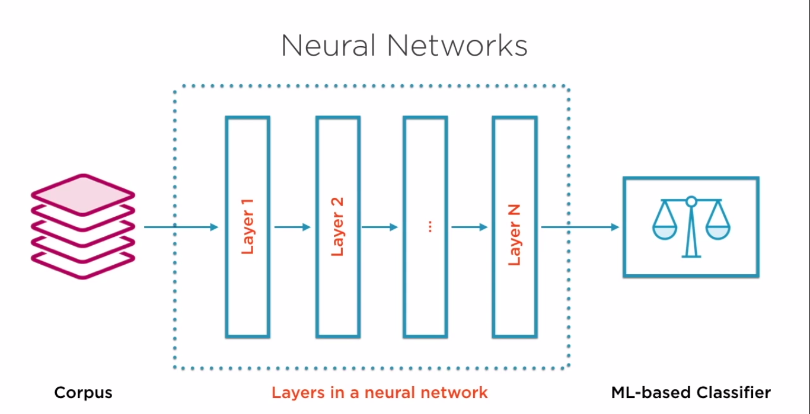
Update

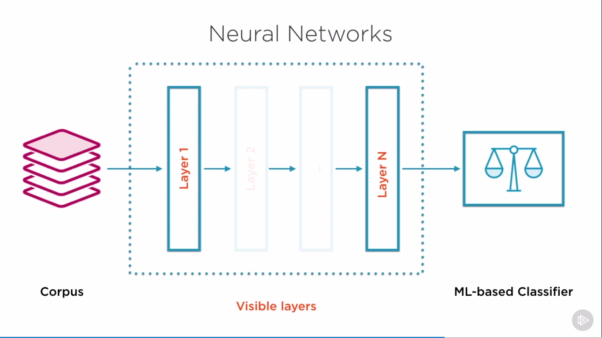

