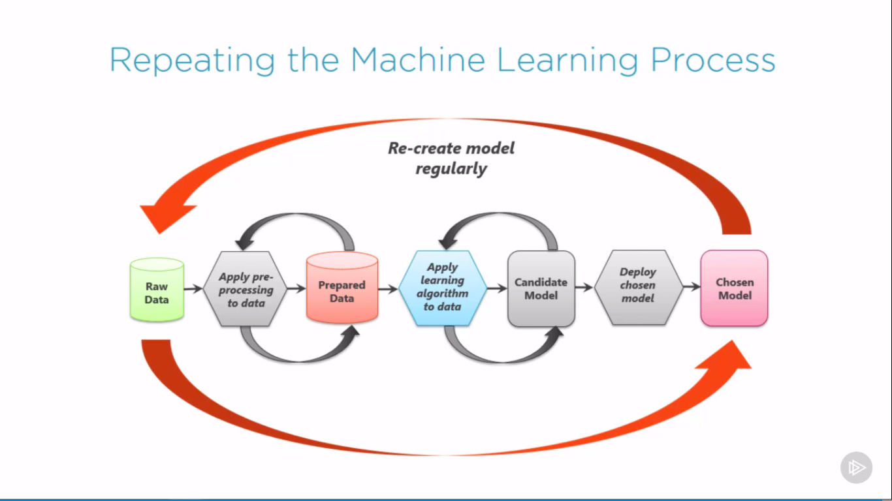

# Nghiên Cứu Khoa Học

# Understanding Machine Learning
## 1. Overview:
- What machine learning is?
- Machine learning process
- Basic concepts & terminology

## 2. What is machine learning?

What machine learning does?

- Finds patterns in data
- Uses those patterns to predict the future
- Examples:
	- Detecting credit card fraud
	- Determining whether a customer is likely to switch to a competitor
	- Deciding when to do preventive maintenance on a factory robot

What does it mean to learn?

How did you learn to read?

Learning requires:

- Identifying patterns
- Recognizing those patterns when you see them again

This is what machine learning does

## 3. Machine learning in a nutshell
- Data: contains pattern
-> Feed data into a machine learning algorithm
- Machine learning algorithm: finds patterns
-> The algorithm generates something called a model
- Model: recognizes patterns
-> Application supplies data to the model
- Application: Supplies new data to see if it matches known pattern

## 4. Why is machine learning is so hot right now?

Doing machine learning requires:

- Lots of data: (Big data)
- Lots of computer power: (Cloud computing)
- Effective machine learning algorithms

=> All of those things are now more available than ever

## 5. Who's interested in Machine learning?
1. Business leaders: want solutions to bussiness problems
2. Software developers: want to create better applications
3. Data scientists: want to powerful, easy-to-use tools

## 6. The ethics of Machine learning?
- What if the data is biased?
- How can you explain a model's decision?

## 7. The main points
- Machine learning lets us find patterns in existing data, then create and use a model that recognizes those patterns in new data
- Machine learning has gone mainstream
	- Although it raises ethical concerns
- Machine learning can probably help your organization

## 8. The machine leaning process

Iterative: In both big and small ways

Challenging: It's rarely easy

Often rewarding: But not always

## 9. The first problem: asking the right question

Choosing what question to ask is the most important of the process

Ask yourself: do you have the right data to answer this question?

Ask yourself: do you know how you'll measure success?

# Foundations of PyTorch

## 1. Getting started with Pytorch for machine learning
### Overiew:
- Deep learning using neural networks
- Neurons and activation functions
- Introducing PyTorch to build neural networks
- Understanding the differences between PyTorch and TensorFlow
### Prerequisites and Course outline:
- Working with Python and Python libraries
- Basic understanding of machine learning algorithms
- No prior experience with neural networks necessary
