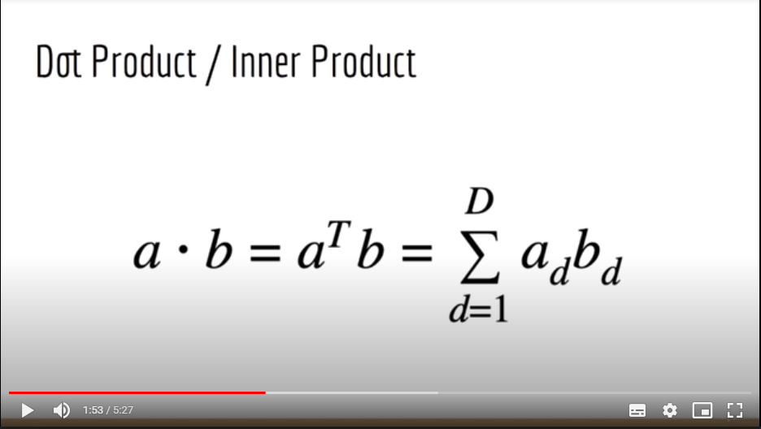
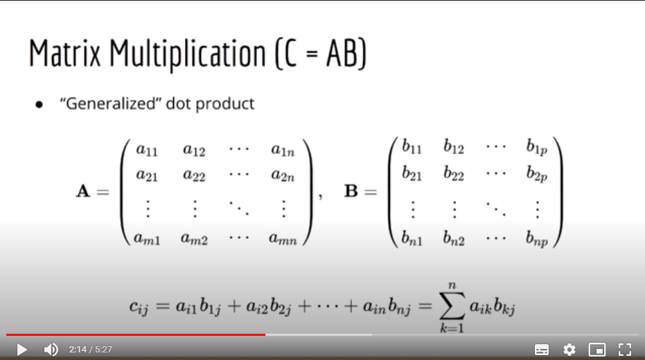

## Numpy
- The core library
- Central object: The Numpy Array
- Be familiar with Python Litss
- One sentence summary: "Linear algebra and a bit of probability" 

Vectors and Matrices
- In Linear algebra, convention to treat vectors as 2-D
- But not in Numpy! Vectors will be 1-D

- Scalar: 1, 2, 3, 4, 5
- Vector: [1, 2, 3]
- Matrix:
	[
		[1, 2, 3],
		[4, 5, 6]
	]

**Dot product/ Inner Product**

Take 2 vectors: a.b. Mulply element wise. And sum all together.

Both input vector must have the same shape.

**Matrix Multiplication (C = AB)**

The number of columns in A must equal to the number of rows in B 

**Element-Wise Product**
[!Element Wise Product](images/elementwiseproduct.png)

Both A and B must have the same shape.

**And many more**
- Linear system: Ax = B
- Inverse: A-1
- Determinant: |A|
- Choosing random numbers

### Applications
1. Linear Regression
2. Logistic Regression
3. Deep Neural Networks
4. K-Means Clustering
5. Density Estimation
6. Principal Components Analysis
7. Matrix Factorization (Recommender System)
8. Support Vector Machines (SVM)
9. Markov Models, HMM
10. Control Systems
11. Game Theory
12. Operations Research

## Compare Python List to Numpy Array

